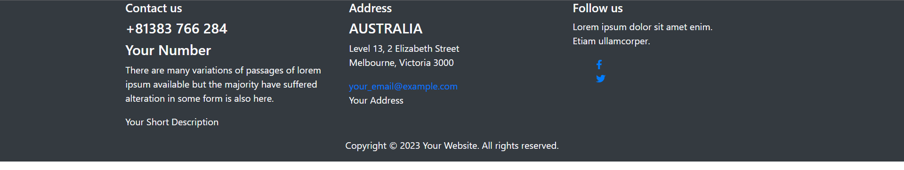

# Website Footer with Dark Background | emore systems

This is a simple HTML and Bootstrap template for a website footer with a dark background. The footer includes contact information, address details, and social media links. It is designed to be responsive and visually appealing.

## Table of Contents

- [Preview](#preview)
- [Features](#features)
- [Usage](#usage)
- [Customization](#customization)
- [Dependencies](#dependencies)
- [License](#license)

## Preview

## Features

- Modern and responsive design.
- Dark background for an elegant look.
- Contact details with phone number and email.
- Address section for location information.
- Social media links to stay connected.

## Usage

1. Clone this repository to your local machine or download the ZIP file.
2. Open the `index.html` file in your web browser.

## Customization

You can easily customize the footer to fit your specific needs:

- Replace the placeholder content with your actual contact information, address, and social media links.
- Modify the color scheme by changing the background color and text color in the `.dark-bg` CSS class.

## Dependencies

This project relies on the following technologies and libraries:

- [Bootstrap 4.5.2](https://getbootstrap.com/docs/4.5/getting-started/introduction/)
- [Font Awesome 5.15.3](https://fontawesome.com/)

Make sure you have an internet connection to load the Bootstrap and Font Awesome resources from their respective CDNs.

## License

This project is licensed under the [MIT License](LICENSE). Feel free to use and modify it for your personal and commercial projects.

---

We hope this footer template helps you enhance your website's design and user experience. If you have any questions or suggestions, feel free to reach out or contribute to the repository. Happy coding!